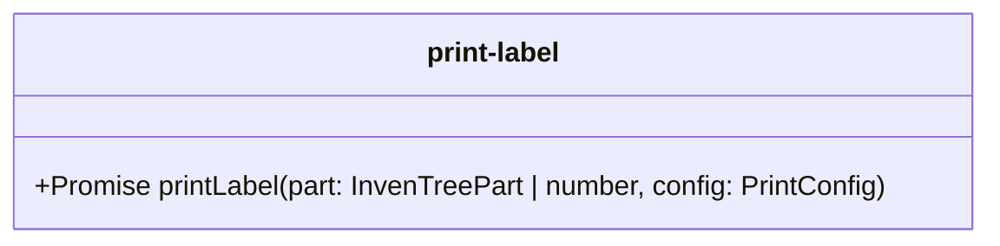

# print-label.ts

**Path:** `services/print-label.ts`  
**Line Count:** 48  
**Functions:** 1  

## Overview

This service is part of the `services` directory.

## Public Interface

- `printLabel`

## Service Interface

## Detailed Documentation

For full implementation details, see the [print-label.ts](../files/print-label.md) file documentation.

