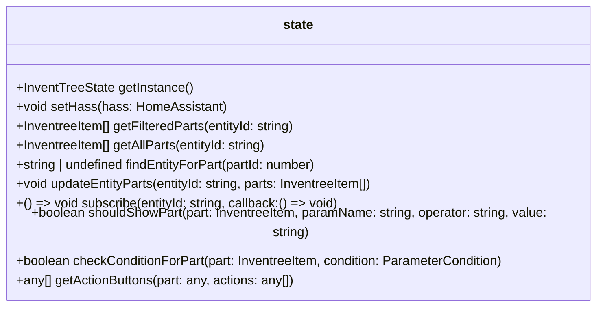

# state.ts

**Path:** `services/state.ts`  
**Line Count:** 144  
**Functions:** 11  

## Overview

This service is part of the `services` directory.

## Public Interface

- `getInstance`
- `setHass`
- `getFilteredParts`
- `getAllParts`
- `findEntityForPart`
- `updateEntityParts`
- `subscribe`
- `shouldShowPart`
- `checkConditionForPart`
- `getActionButtons`

## Service Interface

## Service Usage

- **[[grid-layout|grid-layout]]** uses:
  - `getActionButtons`
- **[[list-layout|list-layout]]** uses:
  - `getActionButtons`
- **[[card-controller|card-controller]]** uses:
  - `setHass`
- **[[parameter-service|parameter-service]]** uses:
  - `findEntityForPart`
- **[[state|state]]** uses:
  - `_getParameterService`
  - `checkConditionForPart`

## Detailed Documentation

For full implementation details, see the [state.ts](../files/state.md) file documentation.

