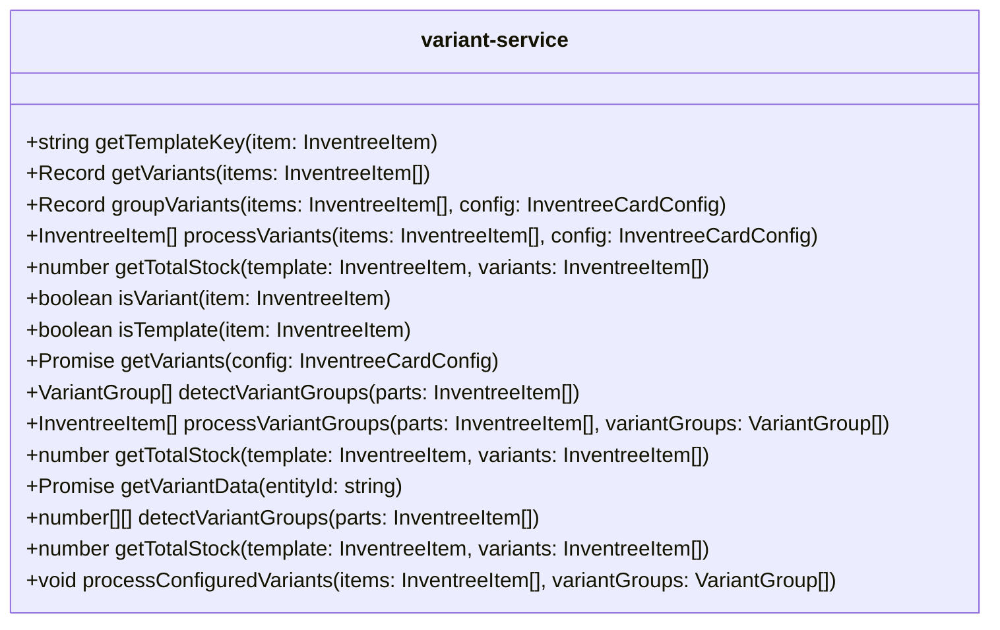

# variant-service.ts

**Path:** `services/variant-service.ts`  
**Line Count:** 300  
**Functions:** 15  

## Overview

This service is part of the `services` directory.

## Public Interface

- `getTemplateKey`
- `getVariants`
- `groupVariants`
- `processVariants`
- `getTotalStock`
- `isVariant`
- `isTemplate`
- `getVariants`
- `detectVariantGroups`
- `processVariantGroups`
- `getTotalStock`
- `getVariantData`
- `detectVariantGroups` - Detect variant groups from a list of parts
- `getTotalStock` - Calculate the total stock for a template part and its variants
- `processConfiguredVariants` - Process variant groups from configuration

## Service Interface

## Service Usage

- **[[variant-service|variant-service]]** uses:
  - `getTemplateKey`
  - `getTotalStock`
  - `groupVariants`

## Detailed Documentation

For full implementation details, see the [variant-service.ts](../files/variant-service.md) file documentation.

