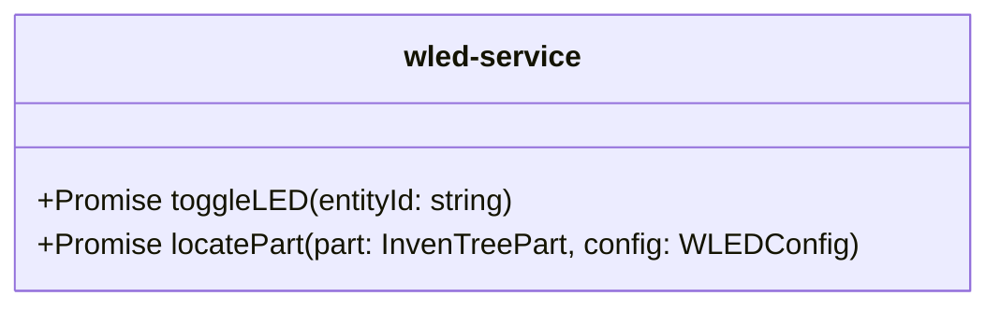

# wled-service.ts

**Path:** `services/wled-service.ts`  
**Line Count:** 102  
**Functions:** 2  

## Overview

This service is part of the `services` directory.

## Public Interface

- `toggleLED`
- `locatePart`

## Service Interface

## Detailed Documentation

For full implementation details, see the [wled-service.ts](../files/wled-service.md) file documentation.

